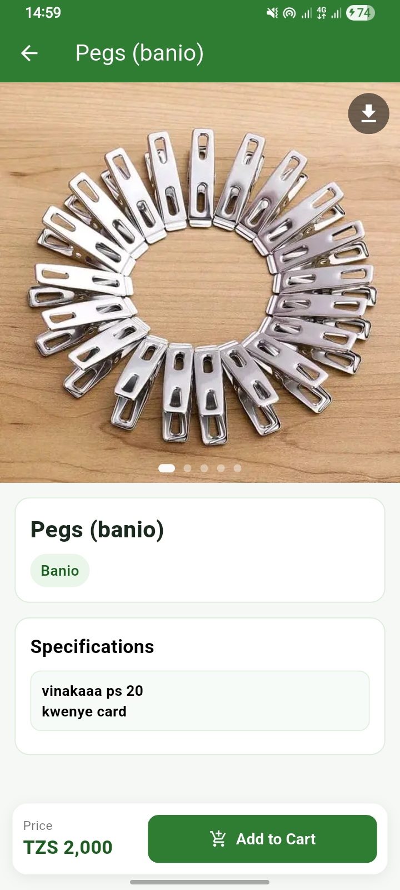

# DMJK Store App and Web

A production-style Flutter commerce application for DMJK Store, built with Firebase as the backend and designed for both customer and admin workflows.

This repository includes:
- Flutter client app (Android, iOS, Web-ready structure)
- Firebase integration (Firestore, Auth, Storage, Cloud Functions, FCM)
- Admin product and order management screens
- AI-assisted product identification flow via callable function

## Why This Project

This project demonstrates end-to-end mobile product engineering skills:
- Flutter UI implementation with responsive layouts and custom components
- Real backend integration with Firebase services
- State management with Provider
- Order lifecycle handling and admin operations
- Push notification flow for new orders
- Feature integration with external APIs (OpenAI via Cloud Functions)

## Core Features

### Customer side
- Product browsing and category filtering
- Search and image-based product identification
- Product detail page with image/video support
- Add-to-cart and checkout experience
- Delivery and pickup order submission
- PDF order summary generation and file opening
- Quick contact actions (WhatsApp and phone)

### Admin side
- Admin login gate based on Firestore role records
- Product CRUD (create, update, delete)
- Product visibility toggle (show/hide from customer view)
- Order monitoring screen
- Push notifications for newly submitted orders

## Screenshots

| Product Detail (Previous Layout) | Product Detail (Current Layout) |
| --- | --- |
|  |  |

## Tech Stack

- Flutter and Dart
- Provider (state management)
- Firebase:
  - Firebase Core
  - Cloud Firestore
  - Firebase Auth
  - Firebase Storage
  - Firebase Cloud Messaging
  - Cloud Functions for Firebase
- Other integrations:
  - Dio and HTTP
  - Video Player
  - Image Picker and Image Compression
  - PDF generation and file opening
  - URL Launcher

## Project Structure

```text
lib/
  main.dart
  models/
  providers/
  screens/
  services/
  widgets/
functions/
  index.js            # Firebase Cloud Functions (Node.js)
  main.py             # Experimental Python function
assets/
  images/
  fonts/
```

## Local Setup

### 1. Prerequisites
- Flutter SDK (compatible with Dart >=2.19.0 and <4.0.0)
- Firebase CLI
- FlutterFire CLI (recommended)
- Android Studio and/or Xcode (for mobile builds)

### 2. Install dependencies

```bash
flutter pub get
```

### 3. Firebase configuration

This project expects Firebase to be configured for the target platforms.

Minimum required steps:
1. Create/select a Firebase project.
2. Add app platforms (Android/iOS/Web as needed).
3. Configure FlutterFire:

```bash
flutterfire configure
```

4. Ensure platform configs are present (such as Android google-services.json and iOS GoogleService-Info.plist).

### 4. Run the app

```bash
flutter run
```

## Cloud Functions Setup (Node.js)

The repository contains Firebase Functions in the functions folder.

Install:

```bash
cd functions
npm install
```

Set required secret for OpenAI-powered image identification:

```bash
firebase functions:secrets:set OPENAI_API_KEY
```

Deploy:

```bash
firebase deploy --only functions
```

## Firestore Data Notes

Expected collections used by the app include:
- products
- orders
- users
- adminTokens

Typical product document fields:
- title
- price
- mediaUrls
- category
- specs
- available
- timestamp

## Quality and Linting

```bash
flutter analyze
flutter test
```

## Deployment Notes

- Keep Firebase rules strict for production.
- Do not expose private keys or secrets in repository history.
- Use Firebase Functions secrets for all sensitive third-party keys.

## Author

Developed by Brian (DMJK Store project).

If you are reviewing this repository for hiring, feel free to open issues or request a walkthrough of architecture decisions and production hardening improvements.
